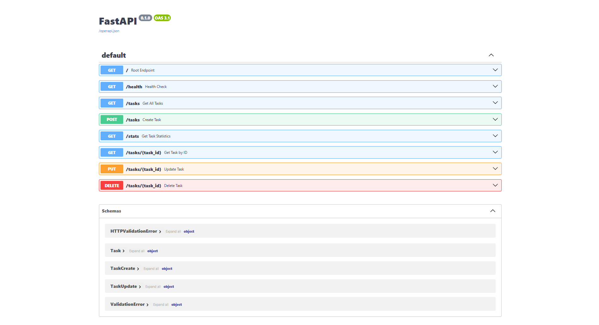

# Todo FastAPI

A lightweight RESTful API for managing tasks built with FastAPI, featuring CRUD operations, request validation, and an SQLite database for persistent storage.

## Features

- CRUD operations for task management
- Request validation using Pydantic
- Interactive OpenAPI (Swagger UI) documentation
- Persistent SQLite database (`tasks.db`)
- Automatic database initialization and seeding
- Standard HTTP status codes and error responses

## Tech Stack

- Python
- FastAPI
- Pydantic
- Uvicorn
- SQLite3 (Built-in)

## Database Overview

This project uses SQLite for persistent storage because it is lightweight, requires no separate server process, and perfectly suits the needs of a simple CRUD API.

The database is located at `tasks.db` in the root of the project. It is created automatically the first time the server starts, and the `tasks` table is seeded with three sample tasks if it is empty.

### Example SQL Query
```sql
SELECT * FROM tasks WHERE done = 0;
```
## Installation

1. Clone the repository:
   ```bash
   git clone https://github.com/bsuryaprakash06/todo-fastapi.git
   cd todo-fastapi
   ```
2. Create and activate a virtual environment:
   ```bash
   python -m venv venv
   # On Windows:
   venv\Scripts\activate
   # On macOS/Linux:
   source venv/bin/activate
   ```
3. Install dependencies:
   ```bash
   pip install -r requirements.txt
   ```

## Running the Application

Start the development server with Uvicorn:

```bash
uvicorn app.main:app --reload
```

The API will be available at `http://127.0.0.1:8000`.

## API Documentation

The interactive API documentation is available at `http://127.0.0.1:8000/docs`.



## API Endpoints

| Method | Endpoint | Description |
|---------|----------|-------------|
| GET | / | API information |
| GET | /health | Health check |
| GET | /tasks | Retrieve all tasks |
| GET | /tasks/{id} | Retrieve a task |
| POST | /tasks | Create a task |
| PUT | /tasks/{id} | Update a task |
| DELETE | /tasks/{id} | Delete a task |

## Example Request

```bash
curl -i -X 'POST' \
  'http://127.0.0.1:8000/tasks' \
  -H 'accept: application/json' \
  -H 'Content-Type: application/json' \
  -d '{
  "title": "Study SQLite"
}'
```

**Response:**
```http
HTTP/1.1 201 Created
Content-Length: 48
Content-Type: application/json

{
  "title": "Study SQLite",
  "id": 4,
  "done": false
}
```

## Project Structure

```text
todo-fastapi/
│
├── app/
│   ├── main.py
│   ├── schemas.py
│   ├── database.py
│   └── helpers.py
│
├── requirements.txt
├── README.md
├── tasks.db
└── LICENSE
```

## License

This project is licensed under the MIT License.
